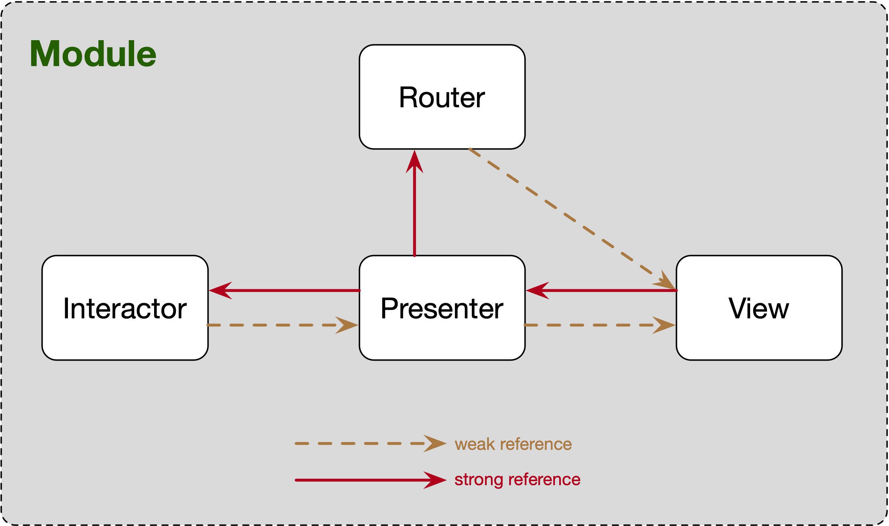
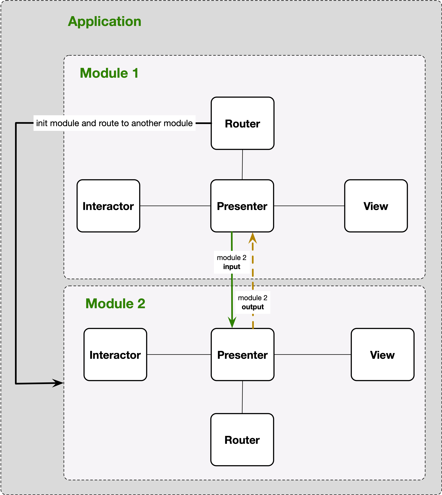

# VIPER Architecture

VIPER is an application of **Clean Architecture** to iOS apps. 

The word VIPER is a backronym for `View`, `Interactor`, `Presenter`, `Entity`, and `Router`

With VIPER applied, the code is easy to understand, easier to test, and as a result, also easier to maintain.

## Main Parts

- **Entity**: contains basic model objects used by the Interactor.
- **Interactor**: contains the *business logic* as specified by a use case
- **Presenter**: contains view logic for *preparing content for display* (as received from the Interactor) and for *reacting to user inputs* (by requesting new data from the Interactor).
- **Router**: contains *navigation logic* for describing which screens are shown in which order.
- **View**: displays what it is told to by the Presenter and relays user input back to the Presenter.

## How We Work With VIPER?

For each module, we have a `Module` class, that will connect all parts of VIPER architecture.

### In a Module

### Module connect to another Module or Submodule

### Using VIPER Template for your Xcode

Our team have create a [VIPER-Template](https://github.com/nimblehq/VIPER-Templates), that helps you create a module with all components you need (Module, Interactor, Presenter, View, Router) and also template for testing.

### Order to implement VIPER's components

After creating a VIPER module, for easy to working with VIPER, I suggest using this order to implement your module.

1. Interactor
2. Presenter
3. View
4. Router

More detail about the code, you can see more in the project `DemoViper`

## Reference: 

- [Architecting iOS Apps with VIPER](https://www.objc.io/issues/13-architecture/viper/)

## License

This project is Copyright (c) 2014-2019 Nimble. It is free software,
and may be redistributed under the terms specified in the [LICENSE] file.

[LICENSE]: /LICENSE

## About

This project is maintained and funded by Nimble.

We love open source and do our part in sharing our work with the community!
See [our other projects][community] or [hire our team][hire] to help build your product.

[community]: https://github.com/nimblehq
[hire]: https://nimblehq.co/
